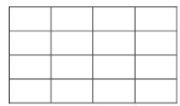
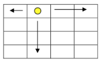
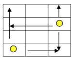
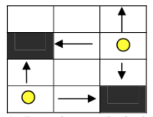
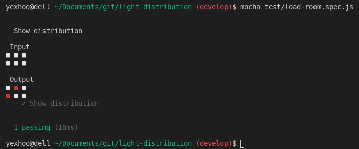
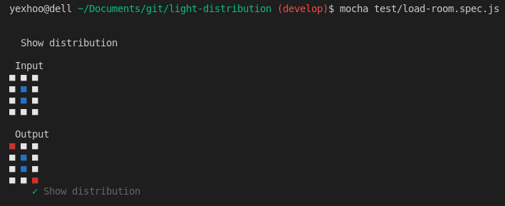
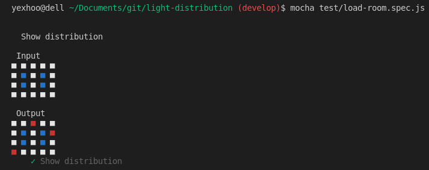

# Light Distribution

Algorithm that obtains the minimum amount of light spots needed to illuminate a room.

A very careful electrician is trying to illuminate at the lowest possible cost the customer rooms.The rooms that he illuminates are always in matrix form (See figure 1). Since the light spots are very expensive, he tries to Illuminate the entire room using the minimum amount of them. The light spots have only scope to illuminate the room horizontally and vertically way (See figure 2 and figure 3). The rooms can have walls inside thwhiem, in this case, the light range of a particular light spot would be interrupted (See figure 4.

<p align="center"><p align="center">figure 1</p></p>
<p align="center"><p align="center">figure 2</p></p>
<p align="center"><p align="center">figure 3</p></p>
<p align="center"><p align="center">figure 4</p></p>

## Options

* **Load room:** In this option the program must load a file
txt that contains the matrix of one and zeros that represents the room, where
the 0 represent the area of ​​the room that is without a wall and the 1 the zones
where there is a wall.

* **Show distribution:** This option
must show the solution of the minimum amount of light spots needed to illuminate the entire room.

***

### Installation

* Open cmd terminal
* You must have installed the latest version of [Node.js](https://nodejs.org/en/).

```sh
$ node -v
v12.14.1

$ npm -v
6.13.4
```

* You must have installed [Mocha](https://mochajs.org/) globally to run tests.

```sh
$ npm install --global mocha
```

* Clone repository

```sh
$ git clone git@github.com:yexhoo/light-distribution.git
```

* Install the dependencies.

```sh
$ cd light-distribution
$ npm install
```

* Run validation tests
```sh
$ mocha test/validations.spec.js

  Light Distribution Validation Test
    ✓ Invalid file name
    ✓ File not found
    ✓ Empty File
    ✓ Matrix must contain only values between 0 and 1
    ✓ All rows of matrix must have the same length
```
***
### How to load room?

* Open load-room.txt file 
```sh  
light-distribution/test/resources/load-room.txt
```
* You must assign the matrix values (0 and 1) to represent the halls and walls.
```sh  
000
000
```

* Run load-room.spec.js test file.
```sh  
$ mocha test/load-room.spec.js
```

* You can see output like this
<p align="center"><p align="center"></p>

***
### Definitions

* When you run ```load-room.spec.js``` file you can see input and output matrix representation.
* 0 value in ```load-room.txt``` file 
is represented by white square
* 1 value in ```load-room.txt``` file 
is represented by blue square.
* Red square represents a light spot.


#### Examples

* example 1
```sh  
000
010
010
000
```
<p align="center"><p align="center"></p>

* example 2
```sh  
00000
01010
01010
00000
```
<p align="center"><p align="center"></p>
